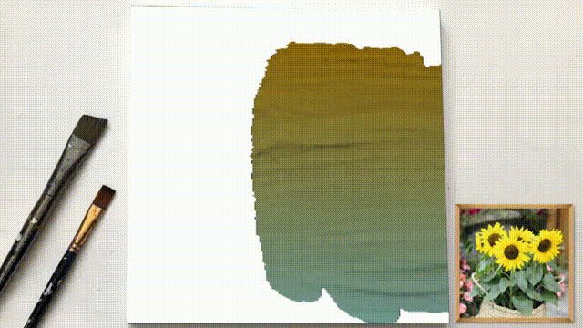

# 基于深度学习的风格化神经网络绘画系统
在这里的所有的文件，没有四个checkpoints_G_***的预训练文件和一个brushes文件，自己粘贴到第一层目录下面就行。
static文件夹下面缺少一个putput文件夹，自己创建即可。

以下链接是原论文的地址和Colab地址：

[Preprint](<https://arxiv.org/abs/2011.08114>) | [Project Page](<https://jiupinjia.github.io/neuralpainter/>)  | [Colab Runtime 1](<https://colab.research.google.com/drive/1XwZ4VI12CX2v9561-WD5EJwoSTJPFBbr?usp=sharing/>)  | [Colab Runtime 2](<https://colab.research.google.com/drive/1ch_41GtcQNQT1NLOA21vQJ_rQOjjv9D8?usp=sharing/>) 




## 项目运行需要的包

详见 [Requirements.txt](Requirements.txt).


## Setup

1. Clone this repo:

```bash
git clone https://github.com/jiupinjia/stylized-neural-painting.git 
cd stylized-neural-painting
```

2. Download one of the pretrained neural renderers from Google Drive (1. [oil-paint brush](https://drive.google.com/file/d/1sqWhgBKqaBJggl2A8sD1bLSq2_B1ScMG/view?usp=sharing), 2. [watercolor ink](https://drive.google.com/file/d/19Yrj15v9kHvWzkK9o_GSZtvQaJPmcRYQ/view?usp=sharing), 3. [marker pen](https://drive.google.com/file/d/1XsjncjlSdQh2dbZ3X1qf1M8pDc8GLbNy/view?usp=sharing), 4. [color tapes](https://drive.google.com/file/d/162ykmRX8TBGVRnJIof8NeqN7cuwwuzIF/view?usp=sharing)), and unzip them to the repo directory.

```bash
unzip checkpoints_G_oilpaintbrush.zip
unzip checkpoints_G_rectangle.zip
unzip checkpoints_G_markerpen.zip
unzip checkpoints_G_watercolor.zip
```

   


## 三种功能
### 功能一：照片转绘画
#### 1、照片转油画


- Progressive rendering

```bash
python demo_prog.py --img_path ./test_images/apple.jpg --canvas_color 'white' --max_m_strokes 500 --max_divide 5 --renderer oilpaintbrush --renderer_checkpoint_dir checkpoints_G_oilpaintbrush 
```

- Rendering directly from mxm image grids

```bash
python demo.py --img_path ./test_images/apple.jpg --canvas_color 'white' --max_m_strokes 500 --m_grid 5 --renderer oilpaintbrush --renderer_checkpoint_dir checkpoints_G_oilpaintbrush
```


#### 2、照片转马克笔画


- Progressive rendering

```bash
python demo_prog.py --img_path ./test_images/diamond.jpg --canvas_color 'black' --max_m_strokes 500 --max_divide 5 --renderer markerpen --renderer_checkpoint_dir checkpoints_G_markerpen 
```

- Rendering directly from mxm image grids

```bash
python demo.py --img_path ./test_images/diamond.jpg --canvas_color 'black' --max_m_strokes 500 --m_grid 5 --renderer markerpen --renderer_checkpoint_dir checkpoints_G_markerpen
```


### 功能二：风格迁移


- First, you need to generate painting and save stroke parameters to output dir

```bash
python demo.py --img_path ./test_images/sunflowers.jpg --canvas_color 'white' --max_m_strokes 500 --m_grid 5 --renderer oilpaintbrush --renderer_checkpoint_dir checkpoints_G_oilpaintbrush --output_dir ./output
```

- Then, choose a style image and run style transfer on the generated stroke parameters

```bash
python demo_nst.py --renderer oilpaintbrush --vector_file ./output/sunflowers_strokes.npz --style_img_path ./style_images/fire.jpg --content_img_path ./test_images/sunflowers.jpg --canvas_color 'white' --renderer_checkpoint_dir checkpoints_G_oilpaintbrush --transfer_mode 1
```

You may also specify the --transfer_mode to switch the transfer mode (0: transfer color only, 1: transfer both color and texture)

Also, please note that in the current version, the style transfer are not supported by the progressive rendering mode. We will be working on this feature in the near future. 

### 功能三：生成8-bit图形作品


```bash
python demo_8bitart.py --img_path ./test_images/monalisa.jpg --canvas_color 'black' --max_m_strokes 300 --max_divide 4
```


## Google Colab

Here we also provide a minimal working example of the inference runtime of our method. Check out the following runtimes and see your result on Colab.

[Colab Runtime 1](https://colab.research.google.com/drive/1XwZ4VI12CX2v9561-WD5EJwoSTJPFBbr?usp=sharing/) : Image to painting translation (progressive rendering)

[Colab Runtime 2](https://colab.research.google.com/drive/1ch_41GtcQNQT1NLOA21vQJ_rQOjjv9D8?usp=sharing/) : Image to painting translation with image style transfer 


## To retrain your neural renderer

You can also choose a brush type and train the stroke renderer from scratch. The only thing to do is to run the following common. During the training, the ground truth strokes are generated on-the-fly, so you don't need to download any external dataset. 

```bash
python train_imitator.py --renderer oilpaintbrush --net_G zou-fusion-net --checkpoint_dir ./checkpoints_G --vis_dir val_out --max_num_epochs 400 --lr 2e-4 --batch_size 64
```


## Citation

If you use this code for your research, please cite our paper:

``````
@inproceedings{zou2020stylized,
    title={Stylized Neural Painting},
      author={Zhengxia Zou and Tianyang Shi and Shuang Qiu and Yi Yuan and Zhenwei Shi},
      year={2020},
      eprint={2011.08114},
      archivePrefix={arXiv},
      primaryClass={cs.CV}
}
``````

